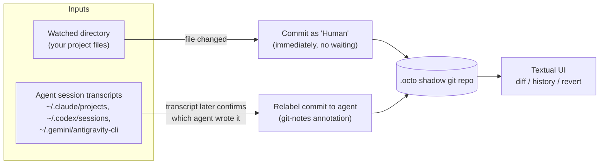
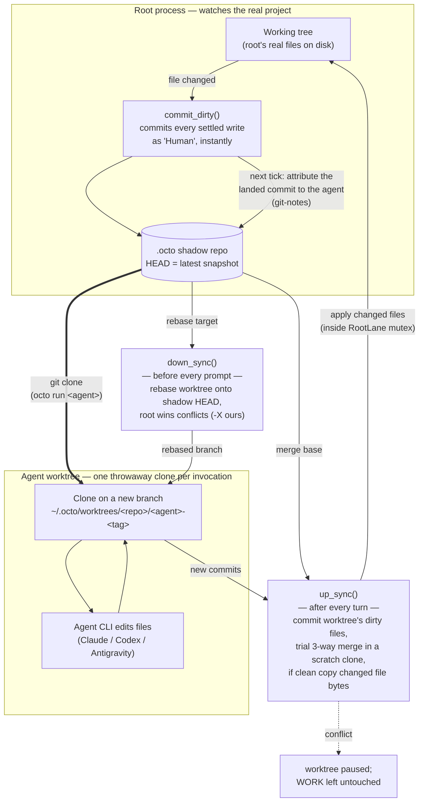

# octo
A tool for tracking the work of your agents in your projects.


## Status: prototype

The current implementation is a prototype and lives entirely in [`pythonPrototype/`](pythonPrototype/).
It watches a directory for file changes and attributes each one to the Claude Code, Antigravity,
or Codex CLI session/prompt that produced it, committing every edit to a shadow git repo (`.octo`)
so you get diffing, history, and revert for free.

The end goal is to rewrite this in a systems language (Zig, C, or C++) for a faster, dependency-free
binary; the Python version exists to validate the design first.

### How it works

octo watches two things at once and joins them together: your project's files, and the session
transcripts each agent CLI already keeps on disk. Every write to disk is committed immediately
under a "Human" author — octo never delays a commit waiting to find out who made it. Once an
agent's own transcript later logs that exact content, the commit is relabeled to that agent via
a git-notes annotation. Git itself is the storage and history engine throughout: no separate
database, diff engine, or undo log — `.octo` is just a real (shadow) git repository, so diffing,
history, and revert all fall out of plain git for free.



Because everything lands in a real git repo, revert is just `git revert`/checkout against `.octo`,
and history is just `git log` — octo's own code only has to watch, correlate, and render.

### Agent worktrees & the sync loop

`octo run <agent>` (below) never lets an agent touch root's real files directly. Instead it clones
root's shadow repo (`.octo`, not the real project `.git` — the shadow repo's HEAD is always a
fresh, git-committed snapshot of what's actually on disk, while the real repo's last commit is only
whatever the human last committed by hand) into a throwaway worktree under `~/.octo/worktrees/`,
on its own branch, and runs the agent CLI there. Two sync functions keep that worktree honest
against root as the agent works:

- **`down_sync`** — before every prompt (`UserPromptSubmit` hook), rebase the worktree onto
  root's shadow HEAD, root winning any textual collision (`-X ours`). Keeps the agent working
  against fresh root state without clobbering its own in-progress edits.
- **`up_sync`** — after every turn (`Stop` hook queues a signal; octo's poll loop drains it), commit
  whatever the agent left dirty, trial-merge the worktree's branch against root's shadow HEAD in a
  disposable scratch clone, and — only if that merge is clean — copy just the changed files' bytes
  onto root's *real* working tree. A conflict aborts the merge, leaves root's files untouched, and
  pauses the worktree instead of guessing.

Landing those bytes on root's working tree is deliberately just a file write, not a direct commit:
the existing `commit_dirty()` pipeline picks them up on its next tick like any other edit and
attributes them to the worktree's agent, so up-synced work shows up in the live feed exactly like a
normal attributed edit. `commit_dirty()`'s own poll-tick flush and up-sync's file-apply step both
mutate root's shadow HEAD/working tree, so a `RootLane` mutex serializes the two instead of letting
them race.



### Entry point

[`pythonPrototype/octo.py`](pythonPrototype/octo.py) is the entry point:

```
python3 pythonPrototype/octo.py [root] [--cwd CWD]
```

- `root` — directory to watch for edits (defaults to the current directory)
- `--cwd` — agent working directory whose sessions to correlate against (defaults to `root`)

To launch an agent CLI in its own isolated git worktree (so its tool use never touches the real
project directory directly), run it through octo instead of invoking it directly:

```
python3 pythonPrototype/octo.py run <agent> [agent-args...]
```

- `agent` — `claude`, `codex`, or `agy` (or their display names — `Claude`, `Codex`, `Antigravity` — matched case-insensitively)
- `agent-args` — forwarded untouched to the real agent CLI
- requires a running `octo [root]` watching the current directory (or a parent/child of it); creates a fresh worktree and branch for this invocation and execs the real agent CLI there

### Building a standalone binary

The prototype ships a PyInstaller spec (`pythonPrototype/octo.spec`) that bundles
`octo.py` into a single executable:

```
cd pythonPrototype
pip install textual pygments pyinstaller
pyinstaller octo.spec
```

The resulting binary is written to `pythonPrototype/dist/octo`.
