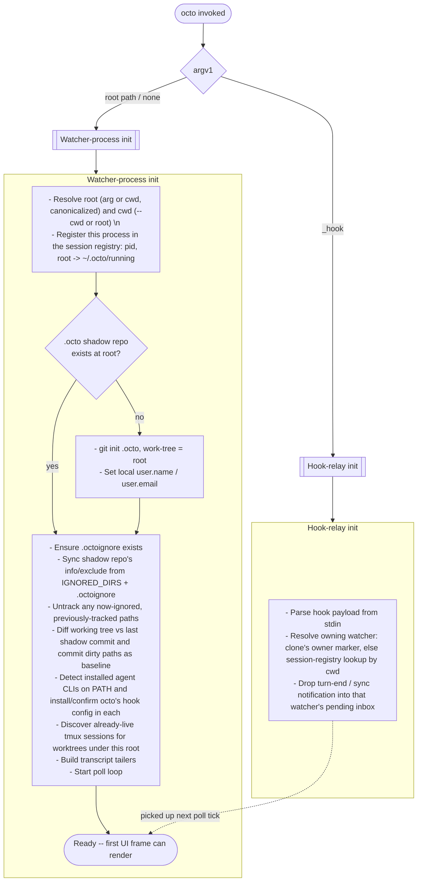

# Backend initialization (design reference)

```mermaid
flowchart TD
    Start([octo invoked]) --> Dispatch{argv1}

    Dispatch -- "_hook" --> HookCmd[[Hook-relay init]]
    Dispatch -- "root path / none" --> Watch[[Watcher-process init]]

    %% ---------------- Watcher process ----------------
    subgraph WatcherInit["Watcher-process init"]
        direction TB
        W1["`- Resolve root (arg or cwd, canonicalized) and cwd (--cwd or root) \n 
- Register this process in the session registry: pid, root -> ~/.octo/running`"]
        W1 --> W4{.octo shadow repo\nexists at root?}
        W4 -- no --> W5["`- git init .octo, work-tree = root
- Set local user.name / user.email`"]
        W4 -- yes --> W7
        W5 --> W7["`- Ensure .octoignore exists
- Sync shadow repo's info/exclude from IGNORED_DIRS + .octoignore
- Untrack any now-ignored, previously-tracked paths
- Diff working tree vs last shadow commit and commit dirty paths as baseline
- Detect installed agent CLIs on PATH and install/confirm octo's hook config in each
- Discover already-live tmux sessions for worktrees under this root
- Build transcript tailers
- Start poll loop`"]
        W7 --> W17([Ready -- first UI frame can render])
    end
    Watch --> WatcherInit

    %% ---------------- _hook relay ----------------
    subgraph HookInit["Hook-relay init"]
        direction TB
        H1["`- Parse hook payload from stdin
- Resolve owning watcher: clone's owner marker, else session-registry lookup by cwd
- Drop turn-end / sync notification into that watcher's pending inbox`"]
    end
    HookCmd --> HookInit
    H1 -.->|picked up next poll tick| W17
```
